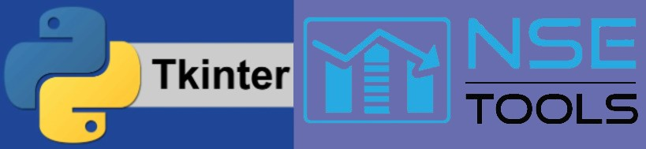

<!--
*** Thanks for checking out the Best-README-Template. If you have a suggestion
*** that would make this better, please fork the repo and create a pull request
*** or simply open an issue with the tag "enhancement".
*** Thanks again! Now go create something AMAZING! :D
-->

<!-- PROJECT SHIELDS -->
<!--
*** I'm using markdown "reference style" links for readability.
*** Reference links are enclosed in brackets [ ] instead of parentheses ( ).
*** See the bottom of this document for the declaration of the reference variables
*** for contributors-url, forks-url, etc. This is an optional, concise syntax you may use.
*** https://www.markdownguide.org/basic-syntax/#reference-style-links
-->
![Contributors][contributors-shield]
![Technologies Used][t-s]

<!-- PROJECT LOGO -->
 

  

  <h3 align="center">Stock Management System with GUI</h3>

  

    <a href="https://github.com/Sahil19191/Stock-Management-System/"><strong>Explore the docs »</strong></a>
     
     
    <a href="https://github.com/Sahil19191/Stock-Management-System/">View Demo</a>
    ·
    <a href="https://github.com/Sahil19191/Stock-Management-System/issues">Report Bug</a>
    ·
    <a href="https://github.com/Sahil19191/Stock-Management-Systemr/issues">Request Feature</a>
  

<!-- TABLE OF CONTENTS -->

  
Table of Contents

  <ol>
    <li>
      <a href="#about-the-project">About The Project</a>
      <ul>
        <li><a href="#built-with">Built With</a></li>
      </ul>
    </li>
    <li>
      <a href="#getting-started">Getting Started</a>
      <ul>
        <li><a href="#prerequisites">Prerequisites</a></li>
      </ul>
    </li>
    <li><a href="#usage">Usage</a></li>
    <li><a href="#contributing">Contributing</a></li>
  </ol>

<!-- ABOUT THE PROJECT -->
## About The Project

This is GUI based local stock management system which is created in Python using Tkinter library. Here NSE api is used to get live data of stocks.

### ScreenShots
![Product Name Screen Shot][product-screenshot1]

![Product Name Screen Shot][product-screenshot2]

![Product Name Screen Shot][product-screenshot3]

![Product Name Screen Shot][product-screenshot4]

![Product Name Screen Shot][product-screenshot5]

![Product Name Screen Shot][product-screenshot6]

![Product Name Screen Shot][product-screenshot7]

![Product Name Screen Shot][product-screenshot8]

![Product Name Screen Shot][product-screenshot9]

![Product Name Screen Shot][product-screenshot10]

### Built With

* [Python](https://www.python.org/)
* [Tkinter](https://docs.python.org/3/library/tkinter.html)
* [Pillow](https://pillow.readthedocs.io/en/stable/)
* [NSE tools](https://nsetools.readthedocs.io/en/latest/)
* [Json](https://docs.python.org/3/library/json.html)

<!-- GETTING STARTED -->
## Getting Started

Simply download to use the application.

Now, install the dependencies mentioned in prerequisites section. 

Simply run the main.py file with the command `python3 main.py`

### Prerequisites

* Python3
* Tkinter
* Pillow
* NSEtools
* Json

<!-- USAGE EXAMPLES -->
## Usage

* Login Page
Register for new id or login directly with previous id and in case you forgot there is an option of forgot password too.

Select the appropiate way to proceed.

* Home Page
In this page we covered all important features like FUNDS, BUY, SELL, 
PORTFOLIO, SEARCH.

A list of some stocks and a search bar to search for a particular stock.

* Funds
Using this you can increase your funds or withdraw it easily.

* Buy and Sell
Using these window you can buy or sell stocks within an instant.

* Portfolio
All your current securities are shown in these window.

* Logout
Your data will only be saved if you log out using this button.

<!-- CONTRIBUTING -->
## Contributing

Contributions are what make the open source community such an amazing place to be learn, inspire, and create. Any contributions you make are **greatly appreciated**.

1. Fork the Project
2. Create your Feature Branch (`git checkout -b feature/AmazingFeature`)
3. Commit your Changes (`git commit -m 'Add some AmazingFeature'`)
4. Push to the Branch (`git push origin feature/AmazingFeature`)
5. Open a Pull Request

<!-- CONTACT -->
## Contact

Sahil Patel - [@Sahil19191](https://github.com/Sahil19191) - sp667369@gmail.com

Parv Patel - 

Raj Patel - [@Raj-mac24](https://github.com/Raj-mac24) - 

Project Link: [https://github.com/Sahil19191/Stock-Management-System](https://github.com/Sahil19191/Stock-Management-System)

[contributors-shield]: https://img.shields.io/github/contributors/Sahil19191/Stock-Management-System?color=Green&label=Contributors

[contributors-url]: https://github.com/othneildrew/Best-README-Template/graphs/contributors
[t-s]: https://img.shields.io/badge/Python3-Tkinter%2C%20Pillow%2C%20%20nseools-green
[product-screenshot1]: Screenshots/Register_page.png
[product-screenshot2]: Screenshots/Login_page.png
[product-screenshot3]: Screenshots/Forget_pass.png
[product-screenshot4]: Screenshots/Homepage.png
[product-screenshot5]: Screenshots/Funds.png
[product-screenshot6]: Screenshots/Search.png
[product-screenshot7]: Screenshots/search_result.png
[product-screenshot8]: Screenshots/Buy.png
[product-screenshot9]: Screenshots/Sell.png
[product-screenshot10]: Screenshots/Portfolio.png
